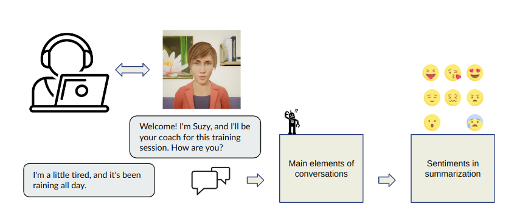

# PSentScore
Code for LREC-COLING 2024 paper "PSentScore: Evaluating Sentiment Polarity in Dialogue Summarization"



This is the Repo for the paper: [PSentScore: Evaluating Sentiment Polarity in Dialogue Summarization](https://arxiv.org/abs/2307.12371)

## Updates
- 2024.05.17 Release code

## Background
Dialogue Summarization: distilling the most crucial information from human conversations into concise summaries

Mostly focusing on summarizing factual information, neglecting the affective content

Sentiments are however crucial for the analysis of interactive data, especially in healthcare and customer service

## Our Work
We hypothesize that sentiments present in a dialogue should be preserved in its summary, both in terms of proportion (factual vs. affective) and sentiment polarity (global vs. local)

We introduce and assess a set of measures PSentScore aimed at quantifying the preservation of affective content in dialogue summaries

Basic requirements for all the libraries are in the `requirements.txt.`

### Direct use
Our trained word-level SA model can be downloaded [here](). Example usage is shown below.

```python
# To use PSentScore based on BERT-DS-SST3 word-level SA model
>>> from psent_score import PSentScorer
>>> psent_scorer = PSentScorer(["PSent", "PSentP", "PSentN"], checkpoint='/yongxin2020/bert_ds_sst3_5e-5_5_42')
>>> from datasets import load_dataset
>>> dialogsum = load_dataset("knkarthick/dialogsum")
# srcs: a list of the source texts, tgts: a list of the target texts
# choose 3 srcs and 3 tgts for inference
>>> srcs = dialogsum["train"]["dialogue"][:3]
>>> tgts = dialogsum["train"]["summary"][:3]
>>> psent_scorer.score(srcs, tgts) 
[out]
{'PSent': {'r': 1.0,
  'ccc': 0.17602839621795402,
  'error': 0.029740204118137593},
 'PSentP': {'r': -0.5,
  'ccc': -0.058764523200519794,
  'error': 0.0166242155358542},
 'PSentN': {'r': nan, 'ccc': nan, 'error': 0.018701902364918487}}
```

### Train your custom PSentScore
If you want to train your custom PSentScore with paired data, you can train a sentiment analysis model tailored to your needs. Once you got your trained model (for example, `my_psentscore` folder). You can use your custom PSentScore as shown below.
<-- we provide the scripts and detailed instructions in the `train` folder. -->

```python
>>> from psent_score import PSentScorer
>>> psent_scorer = PSentScorer(["PSent", "PSentP", "PSentN"], checkpoint='my_psentscore') # your custom SA model path
>>> psent_scorer.score(srcs, tgts) # srcs is the list of source texts and tgts is the list of target texts
```


### Notes on use
- Our measure relies on a word-level sentiment analysis model which is biased and might not be available for all languages
- While the BERT-DS-SST3 model demonstrated promising performance on the SST corpus, it has not been evaluated on dialogue corpora

## Bib
Please cite our work if you find it useful.
```
@inproceedings{zhou-etal-2024-psentscore-evaluating,
    title = "{PS}ent{S}core: Evaluating Sentiment Polarity in Dialogue Summarization",
    author = "Zhou, Yongxin  and
      Ringeval, Fabien  and
      Portet, Fran{\c{c}}ois",
    editor = "Calzolari, Nicoletta  and
      Kan, Min-Yen  and
      Hoste, Veronique  and
      Lenci, Alessandro  and
      Sakti, Sakriani  and
      Xue, Nianwen",
    booktitle = "Proceedings of the 2024 Joint International Conference on Computational Linguistics, Language Resources and Evaluation (LREC-COLING 2024)",
    month = may,
    year = "2024",
    address = "Torino, Italy",
    publisher = "ELRA and ICCL",
    url = "https://aclanthology.org/2024.lrec-main.1163",
    pages = "13290--13302",
    abstract = "Automatic dialogue summarization is a well-established task with the goal of distilling the most crucial information from human conversations into concise textual summaries. However, most existing research has predominantly focused on summarizing factual information, neglecting the affective content, which can hold valuable insights for analyzing, monitoring, or facilitating human interactions. In this paper, we introduce and assess a set of measures PSentScore, aimed at quantifying the preservation of affective content in dialogue summaries. Our findings indicate that state-of-the-art summarization models do not preserve well the affective content within their summaries. Moreover, we demonstrate that a careful selection of the training set for dialogue samples can lead to improved preservation of affective content in the generated summaries, albeit with a minor reduction in content-related metrics.",
}
```
